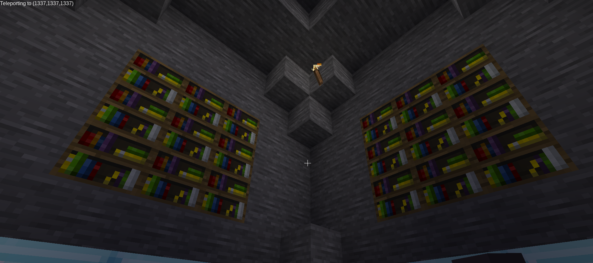

# DarkCTF 2020

## [Crypto] haxXor

> you either know it or not take this and get your flag
>
> 5552415c2b3525105a4657071b3e0b5f494b034515

- From the title, we can guess it's simply a XOR. XORing with the beginning of the flag `darkCTF{` gives us the key `1337hack`

  ```python
  flag_encoded = bytes.fromhex('5552415c2b3525105a4657071b3e0b5f494b034515')
  flag_beg = b"darkCTF{"
  key = []
  flag = []
  i = 0
  
  for c in flag_beg:
      key.append(chr(c ^ flag_encoded[i]))
      i += 1
  
  key = ''.join(key)
  print('Key: ' + key)
  
  i = 0
  for c in flag_encoded:
      flag.append(chr(c ^ ord(key[i % len(key)])))
      i += 1
  
  flag = ''.join(flag)
  print('Flag: ' + flag)
  ```

- Flag: darkCTF{kud0s_h4xx0r}

## [Crypto] Pipe Rhyme

> Wow you are so special.
>
> N=0x3b7c97ceb5f01f8d2095578d561cad0f22bf0e9c94eb35a9c41028247a201a6db95f
> e=0x10001
> ct=0x1B5358AD42B79E0471A9A8C84F5F8B947BA9CB996FA37B044F81E400F883A309B886

- This is a simple RSA challenge, so 

- First we need to find the prime factors of `N`
  

  - We find p = `31415926535897932384626433832795028841` and q = `56129192858827520816193436882886842322337671`

- We then calculate phi, d, and decrypt the cipher to get the flag

  ```python
  from Crypto.Util.number import long_to_bytes
  
  N = 0x3b7c97ceb5f01f8d2095578d561cad0f22bf0e9c94eb35a9c41028247a201a6db95f
  e = 0x10001
  ct = 0x1B5358AD42B79E0471A9A8C84F5F8B947BA9CB996FA37B044F81E400F883A309B886
  
  p = 31415926535897932384626433832795028841
  q = 56129192858827520816193436882886842322337671
  
  phi = (p - 1)*(q - 1)
  d = pow(int(e), -1, phi)
  
  flag = pow(int(ct), d, N)
  
  print('Flag: ' + long_to_bytes(flag).decode('utf-8'))
  ```

- Flag: darkCTF{4v0iD_us1ngg_p1_pr1mes}

## [Linux] linux starter

> Don't Try to break this jail
>
> ssh wolfie@linuxstarter.darkarmy.xyz -p 8001 password : wolfie

- Connecting through SSH, we see that we have a shell with very few commands. We simply find the flag by exploring a bit...


- Flag: darkCTF{h0pe_y0u_used_intended_w4y}

## [Misc] Minetest 1

> Just a sanity check to see whether you installed Minetest successfully and got into the game

- We spawn on a platform with a system of 16 levers


- Switching them up or down gives us the flag


- Flag: DarkCTF{y0u_5uccess_fully_1ns7alled_m1n37e57}

## [Misc] Minetest 2

> Someone messed up my world someone please help me recover my flag. Same file from Minetest 1

- Following the instructions given with the first flag `Teleport to the value you obtained from binary to decimal in the sense (xxxx, xxxx, xxxx) xxxx is the 4 digit number`
  - Lever up = 1, Lever down = 0
  - We transform `0000010100111001` to decimal 1337
- Teleporting to the (1337, 1337, 1337) coordinates places us in this nice cozy room



- Looking through the bookshelves, we find a book containing the flag


- Flag: darkCTF{y0u_4r3_4_1337_p14y3r}

## [Web] Simple_SQL

> Try to find username and password
>
>  [Link](http://simplesql.darkarmy.xyz/)

- Looking at the sources, we get htat we need to pass the GET parameter `id`


- So we manually try some IDs... The 9th one contains the flag


- Flag: darkCTF{it_is_very_easy_to_find}

## [Web] Source

> Don't know source is helpful or not !! http://web.darkarmy.xyz
>
> File

- File

```php
<html>
    <head>
        <title>SOURCE</title>
        <style>
            #main {
    height: 100vh;
}
        </style>
    </head>
    <body><center>
<link rel="stylesheet" href="https://www.w3schools.com/w3css/4/w3.css">
<?php
$web = $_SERVER['HTTP_USER_AGENT'];
if (is_numeric($web)){
      if (strlen($web) < 4){
          if ($web > 10000){
                 echo ('<div class="w3-panel w3-green"><h3>Correct</h3>
  <p>darkCTF{}</p></div>');
          } else {
                 echo ('<div class="w3-panel w3-red"><h3>Wrong!</h3>
  <p>Ohhhhh!!! Very Close  </p></div>');
          }
      } else {
             echo ('<div class="w3-panel w3-red"><h3>Wrong!</h3>
  <p>Nice!!! Near But Far</p></div>');
      }
} else {
    echo ('<div class="w3-panel w3-red"><h3>Wrong!</h3>
  <p>Ahhhhh!!! Try Not Easy</p></div>');
}
?>
</center>
<!-- Source is helpful -->
    </body>
</html>
```

- Looking at the sources, we get that we need to change the user agent in order to receive the flag

  - The length of the user agent must be less than 4, but its value must be over 10'000
  - Checking the PHP documentation for [is_numeric()](https://www.php.net/manual/en/function.is-numeric.php), we see that we can use the E notation
  - We can then set the user agent to `1e5` 

  

- Flag: darkCTF{changeing_http_user_agent_is_easy}

## [Web] Apache Logs

> Our servers were compromised!! Can you figure out which technique they used by looking at Apache access logs.
>
> flag format: DarkCTF{}
>
> Files

- The file contains standard Apache logs, filtering out anything that seem useless leaves us with

```
192.168.32.1 - - [29/Sep/2015:03:37:34 -0400] "GET /mutillidae/index.php?page=user-info.php&username=%27+union+all+select+1%2CString.fromCharCode%28102%2C+108%2C+97%2C+103%2C+32%2C+105%2C+115%2C+32%2C+83%2C+81%2C+76%2C+95%2C+73%2C+110%2C+106%2C+101%2C+99%2C+116%2C+105%2C+111%2C+110%29%2C3+--%2B&password=&user-info-php-submit-button=View+Account+Details
192.168.32.1 - - [29/Sep/2015:03:38:46 -0400] "GET /mutillidae/index.php?csrf-token=&username=CHAR%28121%2C+111%2C+117%2C+32%2C+97%2C+114%2C+101%2C+32%2C+111%2C+110%2C+32%2C+116%2C+104%2C+101%2C+32%2C+114%2C+105%2C+103%2C+104%2C+116%2C+32%2C+116%2C+114%2C+97%2C+99%2C+107%29&password=&confirm_password=&my_signature=&register-php-submit-button=Create+Account
192.168.32.1 - - [29/Sep/2015:03:39:46 -0400] "GET /mutillidae/index.php?page=client-side-control-challenge.php HTTP/1.1" 200 9197 "http://192.168.32.134/mutillidae/index.php?page=user-info.php&username=%27+union+all+select+1%2CString.fromCharCode%28102%2C%2B108%2C%2B97%2C%2B103%2C%2B32%2C%2B105%2C%2B115%2C%2B32%2C%2B68%2C%2B97%2C%2B114%2C%2B107%2C%2B67%2C%2B84%2C%2B70%2C%2B123%2C%2B53%2C%2B113%2C%2B108%2C%2B95%2C%2B49%2C%2B110%2C%2B106%2C%2B51%2C%2B99%2C%2B116%2C%2B49%2C%2B48%2C%2B110%2C%2B125%29%2C3+--%2B&password=&user-info-php-submit-button=View+Account+Details"
```

- Using a [URL decoder](https://www.urldecoder.org/) and the Mozilla reference on [fromCharCode()](https://developer.mozilla.org/fr/docs/Web/JavaScript/Reference/Objets_globaux/String/fromCharCode)
  - The first lines gives us `flag is SQL_Injection` (it wasn't :( )
  - The second line gives us `you are on the right track`
  - So naturally the third line contains the flag
- Flag: DarkCTF{5ql_1nj3ct10n}