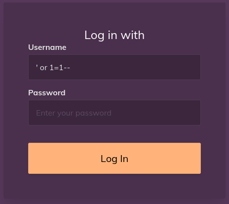
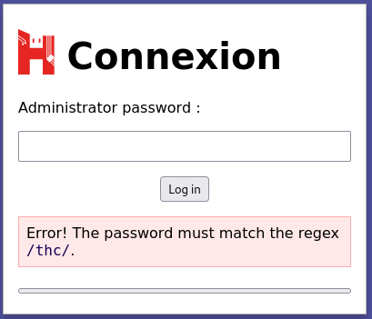
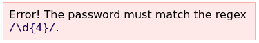
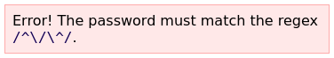
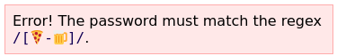
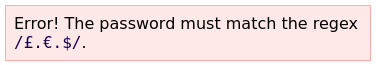
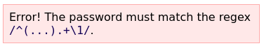
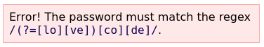
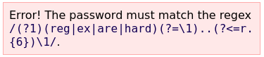

# THC CONF 2021

Okay I waited too long before finishing up this writeup and lost my CTF VM, so I don't have any screenshots nor challenge files to redo them :(

## [Intro] My first one time pad

> I encrypt my flag with a secret key, unfortunately I also encrypted the whole file with the same key could you retrieve the flag ?

- The file `plaintext.txt` :

  ```
  I encrypted a secret flag with one time pad, the result here: 092224674e49392d631f0f5611124274193157441a2e5c2d494e1c1c2d560b204751
  ```

- The file `encrypted.txt` :

  ```
  064e004e171b141554150544414900450a1c4500480303131e00070c060e450c1a49003d491e0d4f050d000c48151e000007161655181c45480e171c1a4f
  ```

- We can get the OTP by XORing the plaintext (in headecimal) with the cyphertext

  ```
  4920656e6372797074656420612073656372657420666c61672077697468206f6e652074696d65207061642c2074686520726573756c7420686572653a203039323232343637346534393339326436333166306635363131313234323734313933313537343431613265356332643439346531633163326435363062323034373531
  ⊕
  064E004E171B141554150544414900450A1C4500480303131E00070C060E450C1A49003D491E0D4F050D000C48151E000007161655181C45480E171C1A4F
  ```

  - The OTP is

    ```
    4F6E652074696D652070616420697320696E207468656F727920706572666563742C20492073686F756C6420686176652075736520746865206B6579206F3677327C252F22226070317D727032213C2F7466786536252F31363E323C72382B70330C7C29397B346C32697D762C64343E2273647B2D267A6A222A2A2D347E3479222A
    ```

    - Which translates to ASCII as `One time pad is in theory perfect, I should have use the key [...]`

- We can now XOR the flag with the OTP key we just found

  ```
  092224674E49392D631F0F5611124274193157441A2E5C2D494E1C1C2D560B204751
  ⊕
  4F6E652074696D652070616420697320696E207468656F727920706572666563742C
  ```

  - The result `464C41473A205448436F6E32317B3154705F7730724B335F306E6C795F306E43337D` gives us the flag once converted from hexadecimal to ASCII.

- FLAG: THCon21{1Tp_w0rK3_0nly_0nC3}

## [Intro] SQL for dummies

> A lazy admin thinks is login page is secure, show him the contrary !

- Basic SQL injection



- Gives us the flag
- Flag: THCon21{eA3y\*QL_1nject0R}

## [Web] Expressive Expressions

> A strange login form.

- On the login page, after trying passwords we get Regex hints

  
  - So we start with the password `thc`

- The second hint

  
  - password: `thc1234`

- Third hint

  

  - password: `/^thc1234`

- 4th hint

  
  - password: `/^thc1234🍕`​

- 5th hint

  
  - password: `/^thc1234🍕£a€b`

- 6th hint

  

  - password: `/^yx/^ythc1234🍕£a€b`

- 7th hint

  

  - password: `/^yx/^ythc1234oe🍕£a€b`

- 8th hint

  


Sadly I never finished this challenge...

## [Programmation] Living QR Code

> Is it alive ? Find what is says !

- Extract all frames from the gif
- Decode all of the  QR Codes
- Flag: THCon21{Ba5ukumqmZIVJ2onznXkfY61YS7Cxdi6}

