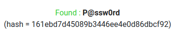
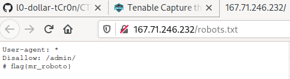
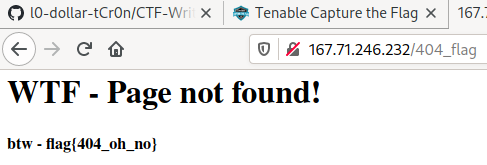
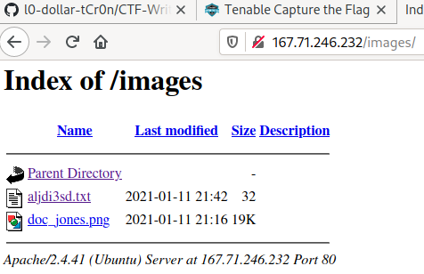
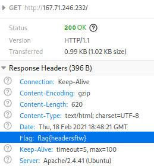
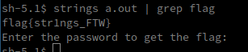

# Tenable CTF 2021

## [Misc] Esoteric

> --[----->+<]>.++++++.-----------.++++++.[----->+<]>.----.---.+++[->+++<]>+.-------.++++++++++.++++++++++.++[->+++<]>.+++.[--->+<]>----.+++[->+++<]>++.++++++++.+++++.--------.-[--->+<]>--.+[->+++<]>+.++++++++.>--[-->+++<]>.

- Using a [brainfuck interpreter](https://www.dcode.fr/brainfuck-language) we get the flag
- Flag: flag{wtf_is_brainfuck}

## [Misc] Quit messing with my flags

> This flag had an accident. What's it really supposed to be? flag{161EBD7D45089B3446EE4E0D86DBCF92}

- This is a MD5 hash, we can use [online tools](https://www.md5online.org/md5-decrypt.html) to decrypt it

- Flag: flag{P@ssw0rd}

## [Web] Stay Away Creepy Crawlers

> Find the flag where they keep the creepy crawlers away.
>
> http://167.71.246.232/

- From the description, we know that the flag is in `robots.txt`

- Flag: flag{mr_roboto}

## [Web] Source of All Evil

> Find the flag
>

- Looking at the **sources**

- Flag: flag{best_implants_ever} 

## [Web] Can't find it

> Find the flag

- Generating a 404 gives us the flag

- Flag: flag{404_oh_no}

## [Web] Show me what you got

> Find the "indexes" flag

- Looking at the images directory, we see a text file containing the flag

- Flag: flag{disable_directory_indexes}

## [Web] Headers for you inspiration

> Find the flag

- Looking at the response headers

- Flag: flag{headersftw}

## [Reverse] The only tool you'll ever need

> Do you know how to use the most powerful reversing tool on the planet?

- Using `strings` on the given executable

  

- Flag: flag{str1ngs_FTW}
