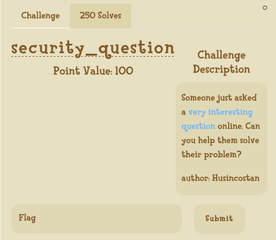
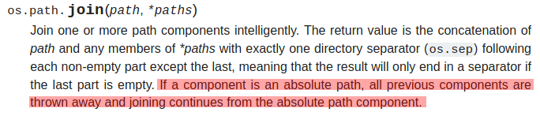

# UIUCTF 2020

## [Warmup] Spoockies


## [Web] security_question



```python
@app.route('/getpoem')
def get_poem():
    poemname = request.args.get('name')

    if not poemname:
        return 'Please send a name query:\n' + str(os.listdir('poems')), 404

    poemdir     = os.path.join(os.getcwd(), 'poems')
    poempath    = os.path.join(poemdir, poemname) 

    if '..' in poemname:
        return 'Illegal substring detected.', 403
    
    if not os.path.exists(poempath):
        return 'File not found.', 404

    return send_file(poempath)
```

- Looking at the code, we can see that :

  - The URL https://security.chal.uiuc.tf/getpoem gives us a list of available poems
  - We can display one of these poems with https://security.chal.uiuc.tf/getpoem?name=tyger.txt
  - And using `..` gives a 403
  - ... but we can pass arguments directly to `os.path.join()` using the `name` parameter

- Looking at its [documentation](https://docs.python.org/3/library/os.path.html)

  

  - We can pass `/hidden_poem.txt` to `name` so that `poemdir` is thrown out of the `poempath` variable
    - https://security.chal.uiuc.tf/getpoem?name=/hidden_poem.txt
  - We could also get any other file given we know its absolute path (https://security.chal.uiuc.tf/getpoem?name=/etc/shadow for example)

- Flag: uiuctf{str_join_is_weird_in_python_3}

## [Forensics] Raymonds Recovery


