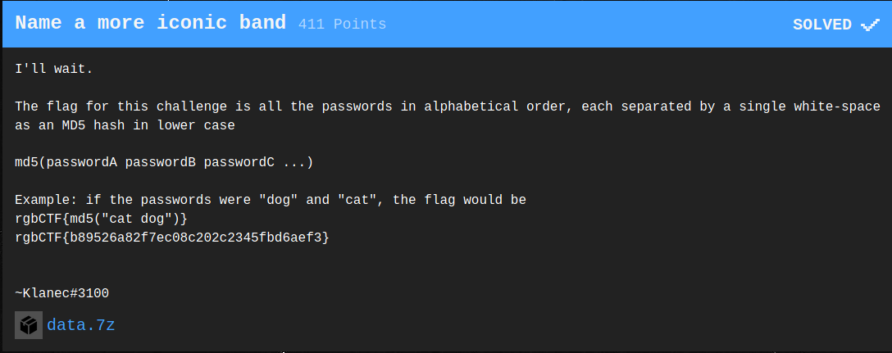
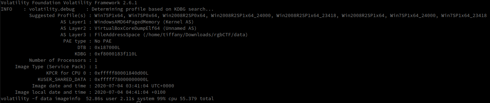
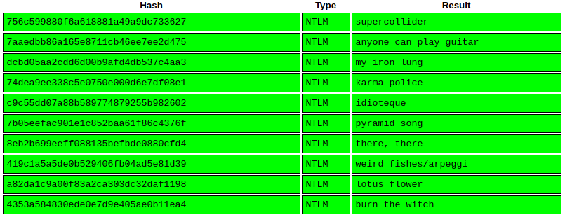
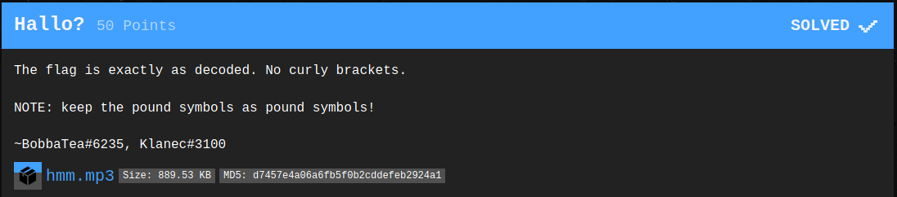

# rgbCTF 2020

## [Beginner] Name a more iconic band



- `file data` --> data: ELF 64-bit LSB core file, x86-64, version 1 (SYSV)
  - It is, however, not an executable but a memory dump (found after using `strings`)

- We can use [Volatility](https://github.com/volatilityfoundation/volatility) to get all the passwords

- First we need to find the profile

  - ```bash
    volatility -f data imageinfo
    ```

    

    - The profile is probably `Win7SP1x64`

- Then we can now dump the passwords

  - ```bash
    volatility -f data --profile=Win7SP1x64 hashdump
    # We could have also used the SAM and SYSTEM's addresses, in this case the result is the same
    # volatility -f data --profile=Win7SP1x64 hivelist
    # volatility -f data --profile=Win7SP1x64 hashdump -y <system_virt_addr> -s <sam_virt_addr>
    ```

    ```
    Administrator:500:aad3b435b51404eeaad3b435b51404ee:756c599880f6a618881a49a9dc733627:::
    Guest:501:aad3b435b51404eeaad3b435b51404ee:31d6cfe0d16ae931b73c59d7e0c089c0:::
    pablo honey:1001:aad3b435b51404eeaad3b435b51404ee:7aaedbb86a165e8711cb46ee7ee2d475:::
    the bends:1002:aad3b435b51404eeaad3b435b51404ee:dcbd05aa2cdd6d00b9afd4db537c4aa3:::
    ok computer:1003:aad3b435b51404eeaad3b435b51404ee:74dea9ee338c5e0750e000d6e7df08e1:::
    kid a:1004:aad3b435b51404eeaad3b435b51404ee:c9c55dd07a88b589774879255b982602:::
    amnesiac:1005:aad3b435b51404eeaad3b435b51404ee:7b05eefac901e1c852baa61f86c4376f:::
    hail to the thief:1006:aad3b435b51404eeaad3b435b51404ee:8eb2b699eeff088135befbde0880cfd4:::
    in rainbows:1007:aad3b435b51404eeaad3b435b51404ee:419c1a5a5de0b529406fb04ad5e81d39:::
    the king of limbs:1008:aad3b435b51404eeaad3b435b51404ee:a82da1c9a00f83a2ca303dc32daf1198:::
    a moon shaped pool:1009:aad3b435b51404eeaad3b435b51404ee:4353a584830ede0e7d9e405ae0b11ea4:::
    ```

  - Passing those NTLM hashes  (not the Guest one as it is the empty password's hash) to [CrackStation](https://crackstation.net/) gives 

- Once we reorder the passwords in alphabetical order, we get the string `anyone can play guitar burn the witch idioteque karma police lotus flower my iron lung pyramid song supercollider there, there weird fishes/arpeggi`
  - Its MD5 hash is `cf271c074989f6073af976de00098fc4`
- Flag: rgbCTF{cf271c074989f6073af976de00098fc4}

## [Misc] Hallo?



- Listening to the audio, we immediately recognize DTMF tones
- Using a [DTMF decoder app](https://play.google.com/store/apps/details?id=com.encapsystems.dtmfd&hl=en), we get the string `777,4,22,222,8,333,#,999,33,33,8,#,3,8,6,333,#,8,666,66,33,7777,#`
- Which translates from T9 to `RGBCTF#YEET#DTMF#TONES#`
- Flag: RGBCTF#YEET#DTMF#TONES#